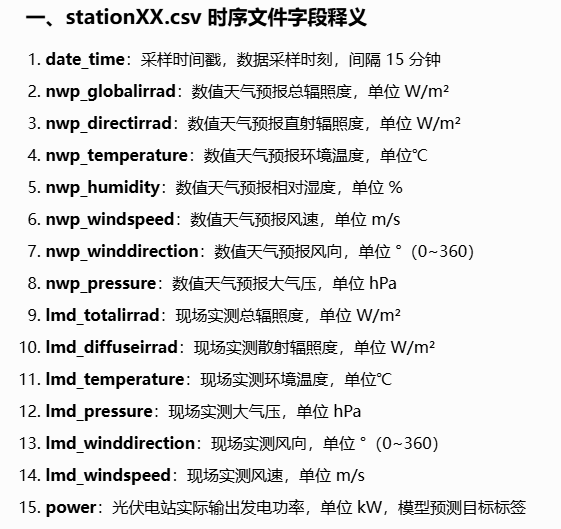
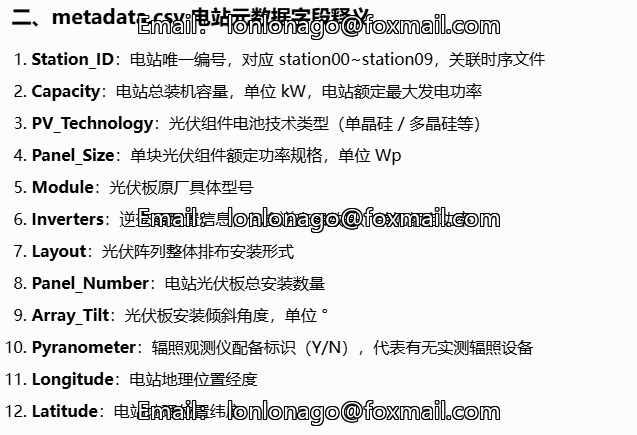

## Body

Photovoltaic Power Output Data Set

The dataset consists of 271,968 records, divided into two data sources with a 15-minute interval: numerical weather prediction (NWP) from meteorological services and local measurement data from photovoltaic power stations (LMD).

It includes seven features, namely global irradiance, direct irradiance, temperature, humidity, wind speed, wind direction, and pressure.

The local measurement data also includes seven features, namely global irradiance, diffuse irradiance, temperature, pressure, wind direction, wind speed, and photovoltaic output records.

Specifically, the data timestamp is UTC, while Beijing time is UTC+8.

Please read the dataset article before using it. The source article can be found in the dataset article.

## Images

Here is a pay link on Stripe ( https://buy.stripe.com/3cs8yP7sY87d0vu9AB ). Please contact me lonlonago@foxmail.com after funding $89, and I will send you a complete data files , thank you!

